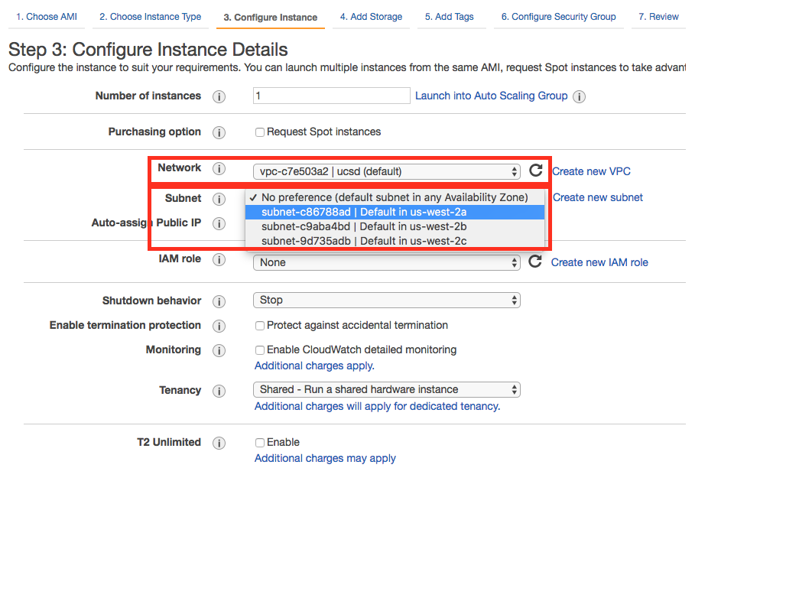
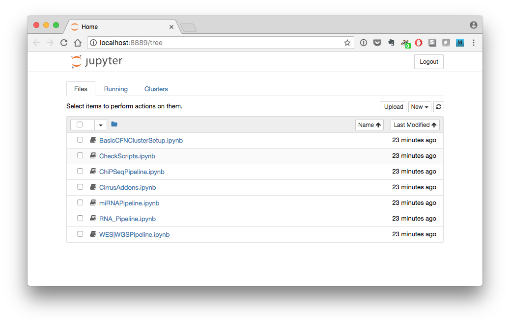

# Cirrus-NGS

Cloud-optimized primary analysis pipelines for RNA-seq, miRNA-seq, ChIP-seq, and variant calling in whole-genome/whole-exome DNA-Seq.

## Introduction

Bionformatic analysis of large-scale next-generation sequencing (NGS) data requires significant compute resources. While cloud computing makes such processing power available on-demand, the administration of dynamic compute clusters is a daunting task for most working biologists.  To address this pain point, the Center for Computational Biology and Bioinformatics at the University of California, San Diego, has developed Cirrus-NGS, a turn-key solution for common NGS analyses using Amazon Web Services (AWS).
	
Cirrus-NGS provides primary analysis pipelines for RNA-Seq, miRNA-Seq, ChIP-Seq, and whole-genome/whole-exome sequencing data.  Cirrus users need not have any bioinformatics tools for these pipelines installed on their local machine, as all computation is performed using AWS clusters and all results are uploaded to AWS's S3 remote storage.  The clusters are created dynamically through Cirrus-NGS, based on a custom machine image with all the necessary software pre-installed.  Users manage clusters and run pipelines from within a web browser, using flexible but light-weight Jupyter notebooks.

## Installation

### Getting an AWS Account

Because Cirrus-NGS employs AWS for computation and storage, users must have an active AWS account.  If you do not have such an account, visit [https://docs.aws.amazon.com/AWSEC2/latest/UserGuide/get-set-up-for-amazon-ec2.html](https://docs.aws.amazon.com/AWSEC2/latest/UserGuide/get-set-up-for-amazon-ec2.html) for guidance on how to create one, and execute the steps it describes. 


### Installing `conda`

While Cirrus-NGS itself is provied through github, its supporting libraries are best installed through conda, a cross-platform package manager.  If you do not have conda installed already, download the appropriate Python-3.6-based installer from the links below:

* linux: [https://repo.continuum.io/miniconda/Miniconda3-latest-Linux-x86_64.sh](https://repo.continuum.io/miniconda/Miniconda3-latest-Linux-x86_64.sh)
* OSX: [https://repo.continuum.io/miniconda/Miniconda3-latest-MacOSX-x86_64.sh](https://repo.continuum.io/miniconda/Miniconda3-latest-MacOSX-x86_64.sh)

Then run the installer with the following script, replacing `<miniconda_py3.sh>` with the name of the install script downloaded above:

	bash <miniconda_py3.sh> -b -p $HOME/miniconda3
	echo "export PATH=\"$HOME/miniconda3/bin:\$PATH\"" >>$HOME/.bashrc
	source $HOME/.bashrc	

### Installing Cirrus-NGS

Cirrus-NGS is available for linux-64 or osx-64 platforms, and requires python 3.5 or higher.

In the directory in which you would like to install Cirrus-NGS, run the following commands:

	conda install paramiko pyyaml git jupyter notebook
	pip install scp cfncluster
	git clone https://github.com/ucsd-ccbb/Cirrus-NGS.git

These commands install the necessary supporting libraries and create a new directory called `Cirrus-NGS` that holds the Cirrus software.

### Starting the notebook server

Since the Cirrus-NGS interface is provided through Jupyter notebooks, the first step of running Cirrus is to start a local Jupyter notebook server. From the `Cirrus-NGS` directory, run:

	cd notebooks/cirrus-ngs
	jupyter notebook

You will receive a message like

	[I 10:48:39.779 NotebookApp] Serving notebooks from local directory: /Users/<YourName>/Cirrus-NGS/notebooks
	[I 10:48:39.779 NotebookApp] 0 active kernels 
	[I 10:48:39.779 NotebookApp] The Jupyter Notebook is running at: http://localhost:8889/?token=8dcb989e6852e3dfd679307470e17696c32771432c881573
	[I 10:48:39.779 NotebookApp] Use Control-C to stop this server and shut down all kernels (twice to skip confirmation).
	
**Note the URL at which the server is running**.  It is usually http://localhost:8888, but if your system already has something running on port 8888, it may default so something else (e.g., in the example above, it is http://localhost:8889).

**Do not shut down the Jupyter notebook server** or close the terminal window in which it is running until you are done using Cirrus-NGS, as it must be running in order for the Cirrus-NGS notebooks to function.  When you are done using Cirrus and ready to shut down the notebook server, simply type `Control-C` in the terminal window where it is running and follow the prompts.

## Running Cirrus-NGS

### General Overview

A user begins by creating a cluster.  After this, sh/e decides upon the pipeline to run, which determines the exact inputs required, and then creates (in a spreadsheet program or text editor) a design file that specifies the details of the input sequencing data.  S/he starts the Jupyter notebook for the chosen pipeline and inputs the path to the design file and other required inputs (such as AWS credentials, etc), then executes the notebook code to start the pipeline processing.  

The notebook creates a yaml file summarizing all of the user input and transfers that file to the cluster, where it directs cluster-native code to sequentially execute the analysis steps specified by the user in a distributed fashion. Upon completion of each step, the output is uploaded to the user's specified S3 output bucket, from which it can be accessed at any point. During processing, the user can check the status of the pipeline run and manage the cluster status from within the notebook.

**A Note About Terminology**: Throughout, the term "pipeline" is used to describe functionality for analyzing a general type of sequencing (such as RNA-Seq or whole-genome sequencing).  Each pipeline can have multiple, more granular "workflows" that support different approaches to processing the same type of sequencing data; for instance, the RNA-Seq pipeline contains four different workflows (star_gatk, star_htseq, star_rsem, and kallisto).

### Gathering Required Inputs

Before beginning work with Cirrus-NGS, gather the following information:

1. The AWS access key ID
	* See [https://docs.aws.amazon.com/general/latest/gr/managing-aws-access-keys.html](https://docs.aws.amazon.com/general/latest/gr/managing-aws-access-keys.html) to find your existing access key or create a new one)
2. The AWS secret access key (see above link for more information)
3. A valid key pair (.pem) file for the account
	* If you encounter a `Permission denied (publickey) error`, note that the permissions on your key (.pem) file **must** be set so that it is not public, e.g. by running `chmod 0400 <mypemfilename>.pem` in the directory where the .pem file is located.
	* See [https://docs.aws.amazon.com/AWSEC2/latest/UserGuide/ec2-key-pairs.html#having-ec2-create-your-key-pair](https://docs.aws.amazon.com/AWSEC2/latest/UserGuide/ec2-key-pairs.html#having-ec2-create-your-key-pair) for further details.
<!--TODO: Add region-->
4. The VPC (Virtual Private Cloud) id for the account
	* If you do not know the VPC id, you can find it by going part-way through the process of launching an AWS compute instance.  Follow the instructions at [https://docs.aws.amazon.com/AWSEC2/latest/UserGuide/launching-instance.html](https://docs.aws.amazon.com/AWSEC2/latest/UserGuide/launching-instance.html) up until step 6 (it does not matter what values you select during these steps, as you won't need to actually launch the instance).  Step 6 brings you to the "Configure Instance Details" screen, on which you can find your VPC id, as well as your subnet ids (see next item):
	
	
	
5. The subnet id for the account for the region in which you wish to create the cluster (see above for how to find this value)
4. The URL of an existing AWS S3 remote storage bucket where you have placed your sequencing data.
	* Visit [https://docs.aws.amazon.com/AmazonS3/latest/gsg/GetStartedWithS3.html](https://docs.aws.amazon.com/AmazonS3/latest/gsg/GetStartedWithS3.html) and execute the "Sign Up for Amazon S3" and "Create a Bucket" steps (click on the boxes in the workflow diagram for detailed instructions) if you do not already have a bucket set up.
	* To place your sequencing files into the bucket, follow the directions for the "Add an Object to a Bucket" step, or use an S3-enabled transfer client like [Cyberduck](https://cyberduck.io/).
5. (Optional) The URL of a second existing AWS S3 remote storage bucket for Cirrus-NGS outputs.

### Creating a Cluster

Run the following steps to create a cluster.  You may then use that cluster for all Cirrus-NGS work going forward without having to rerun these steps (although you may also rerun them to create additional clusters, if desired).

1. In your browser, visit the address at which the Jupyter notebook server is running
	* This is usually http://localhost:8888, but see the [Starting the Notebook Server](#Starting-the-notebook-server) section for additional details.
	* You will see a list of all the Cirrus-NGS notebooks:

	 
2. Click on the `BasicCFNClusterSetup.ipynb` notebook to start it.
3. Fill in the parameters in the first two cells in the notebook, using the values identified above in the [Gathering Required Inputs](#Gathering-Required-Inputs) section where relevant. <!--TODO:expand-->
4. Run the notebook.<!--TODO:expand-->


### Running a Pipeline

1. Choose the pipeline you wish to run.
	* Cirrus-NGS currently offers pipelines for RNA-Seq, miRNA-seq, ChIP-seq, and variant calling in whole-genome/whole-exome DNA-Seq.
2. Create a design file for your data.
	* The design file is a tab-separated text file with either two or three columns (depending on the workflow chosen) that specifies the names of the sequence files to process and the necessary metadata describing them.
	* See the [Building a Design File](#Building-a-Design-File) section below for full specifications of the design file format.
3. In your browser, visit the address at which the Jupyter notebook server is running
	* This is usually http://localhost:8888, but see the [Starting the Notebook Server](#Starting-the-notebook-server) section for additional details.
	* You will see a list of all the Cirrus-NGS notebooks:

	
4. Click on the appropriate notebook for your chosen pipeline to start it.
5. Fill in the parameters in the first two cells in the notebook, using the values identified above in the [Gathering Required Inputs](#Gathering-Required-Inputs) section where relevant.<!--TODO:expand-->
6. Run the notebook.<!--TODO:expand-->
7. After the pipeline processing is complete, download the output files from your S3 bucket for further analysis locally.
	* To download the outputs from your bucket, follow the directions for the "View an Object" step at [https://docs.aws.amazon.com/AmazonS3/latest/gsg/OpeningAnObject.html](https://docs.aws.amazon.com/AmazonS3/latest/gsg/OpeningAnObject.html) or use an S3-enabled transfer client like [Cyberduck](https://cyberduck.io/).

## Building a Design File
The design file is the primary user input to Cirrus-NGS. It is a tab-separated text file that specifies the names of the sequence files to process and the necessary metadata describing them.  For the RNA-Seq and miRNA-Seq pipelines, it contains two columns, while for the ChIP-Seq and whole-exome/whole-genome sequencing pipelines, it contains three columns (of which the first two are the same as in the two-column format).  The design file has no header line.

### Two-column format
In the two-column format, the **first column** is the filename of the sample (with extensions: e.g. fastq.gz), while the **second column** is the name of the group associated with that sample.  (Group names are up to the user, but they are generally set to experimental conditions. For example, all control samples can be given a group named "control".)

For example, a two-column design file for two single-end-sequenced samples named `mysample1` and `mysample2` might look like:

```
	mysample1.fastq.gz		groupA
	mysample2.fastq.gz		groupB
```

If the sequencing data is paired-end, the first column includes the name of the forward sequencing file, followed by a comma, followed by the name of the reverse sequencing file (note that there must **not** be any spaces between these two file names--only a comma!)  An example two-column design file for two paired-end-sequenced samples named `mysample1` and `mysample2` might look like:

```
	mysample1_fwd.fastq.gz,mysample1_rev.fastq.gz		groupA
	mysample2_fwd.fastq.gz,mysample2_rev.fastq.gz		groupB
```

### Three-column format
The three-column format has the same first two columns as the two-column format, but adds a third column containing a pipeline-specific identifier that differentiates sample types for the ChIP-Seq and whole-genome/whole-exome sequencing pipelines.

* For the ChIP-Seq pipeline, each sample is identified as either Chip or Input.
* For the whole-genome/whole-exome sequencing pipeline, each sample is identified as either Tumor or Normal.

The following constraints apply to three-column design files:
	
* The sample type identifiers are **case-sensitive**.
	* For example, a three-column design file for two paired-end-sequenced ChIP-Seq samples named `mysample1` and `mysample2` might look like 
	
	```
	mysample1_fwd.fastq.gz,mysample1_rev.fastq.gz		groupA		Chip
	mysample2_fwd.fastq.gz,mysample2_rev.fastq.gz		groupB		Input
	```

* Each three-column design file must use **either** Chip and Input sample type identifiers **or** Normal and Tumor sample type identifiers, but not both.
	* A design file like the example below would thus be **invalid**:

	```
	mysample1_fwd.fastq.gz,mysample1_rev.fastq.gz		badExample1		Chip
	mysample2_fwd.fastq.gz,mysample2_rev.fastq.gz		badExample1		Tumor
	```
* Each group must have exactly one sample designed with each of the two relevant sample type identifiers.	* A design file like the example below would thus be **invalid**:

	```
	mysample1_fwd.fastq.gz,mysample1_rev.fastq.gz		badExample2		Normal
	mysample2_fwd.fastq.gz,mysample2_rev.fastq.gz		badExample2		Normal
	```	
* If two samples are designated as forming a Chip/Input or Normal/Tumor pair, they must both have the same group.
	* A design file like the example below would thus be **invalid**:

	```
	mysample1_fwd.fastq.gz,mysample1_rev.fastq.gz		badExample3		Normal
	mysample2_fwd.fastq.gz,mysample2_rev.fastq.gz		badExample4		Tumor
	```


  

